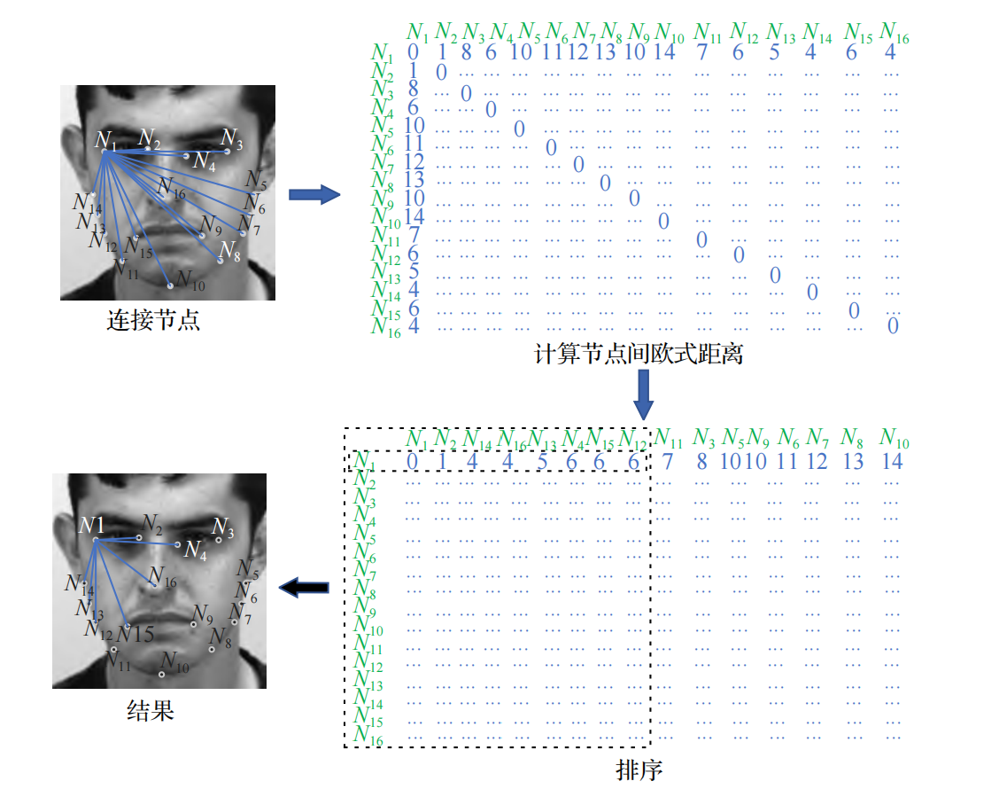
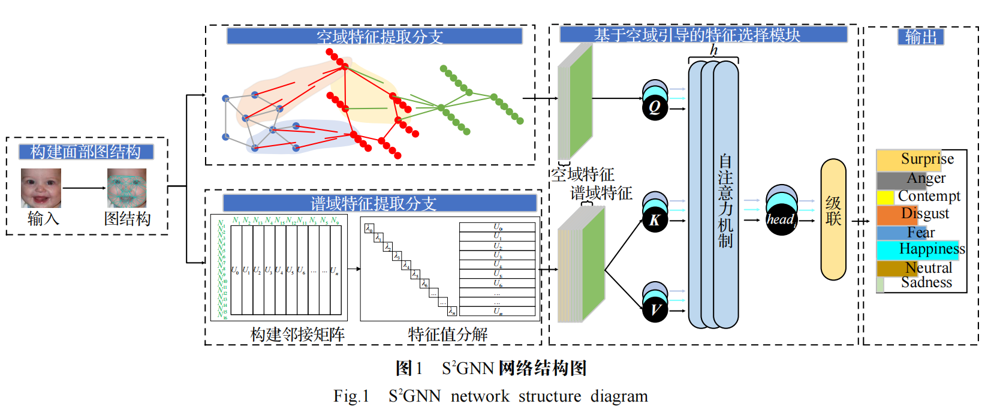
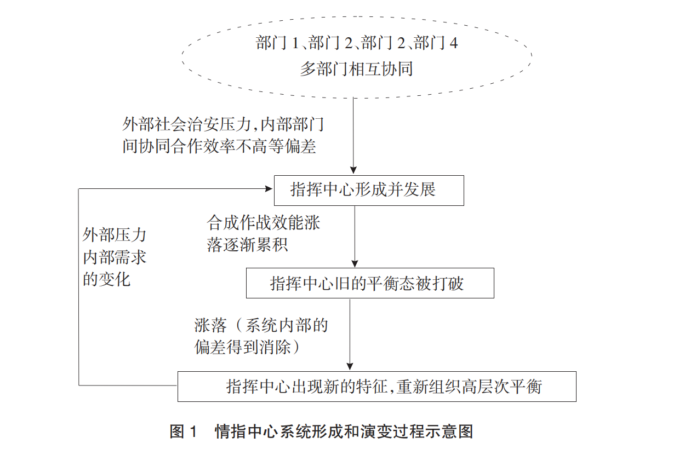
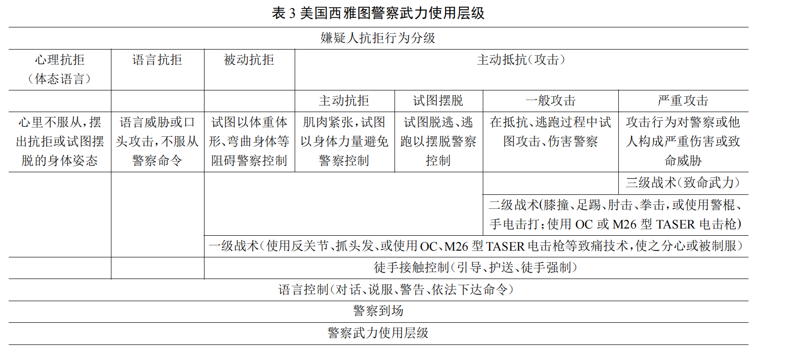
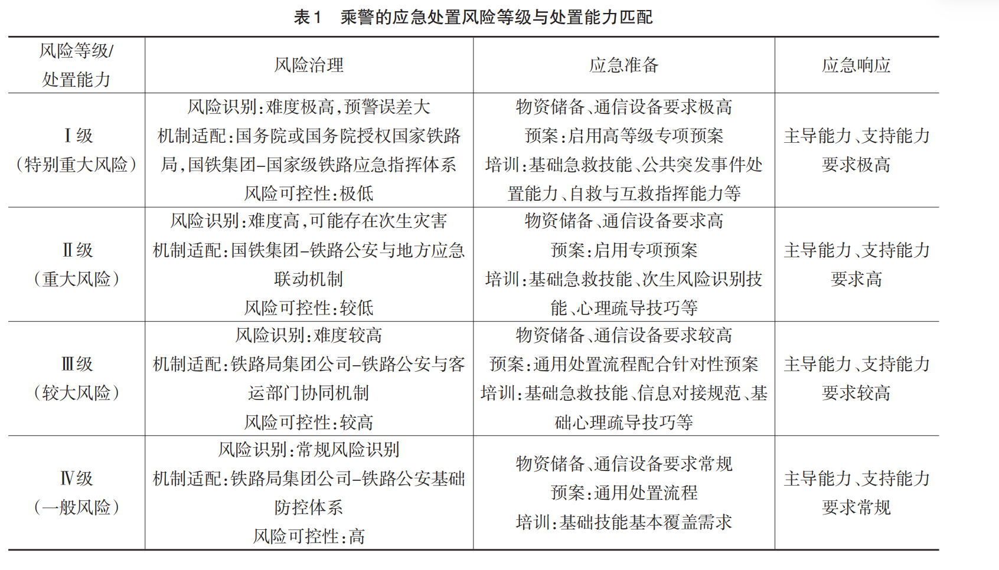
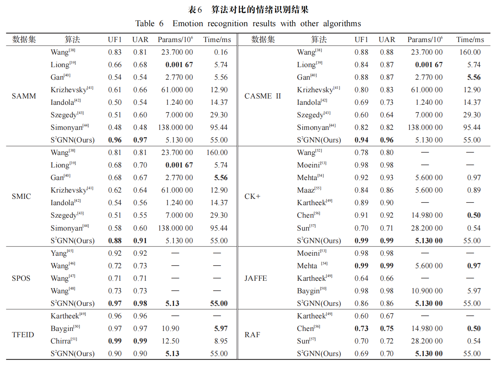

## Overview

- **Motivation:** Modern policing faces challenges in large-event traffic command, fragmented “Intelligence–Command–Action” coordination, railway water-damage emergencies, unclear use-of-force discretion, and expression recognition with limited data.

- **Methods:** The studies use case analysis, theoretical modeling, and algorithm design: a “1+3+N” traffic command model, synergetic analysis of ICA reform, the K396 incident, a force-discretion model, and the S³GNN graph neural network.

- **Outcomes:** They provide integrated command frameworks, improved inter-agency coordination, emergency countermeasures, a dynamic discretion model for force, and S³GNN achieving 89.11% accuracy with strong limited-data performance.


```python
def hello(name: str) -> str:
    return f"Hello, {name}!"
```
- **Main Formula Examples in the Article**

Facial Expression Detection via S<sup>2</sup>GNN: Principle and Formulation

$$
y = softmax(fc(Fusion([y_1, y_2])))
$$


Multi-layer Feature Extraction Network

$$
H_{\text{spa}}^{(K)} = Layer_K(H^{(K-1)}, W^{(K-1)})
$$

Laplacian Matrix Eigen-decomposition Formula

$$
L = V \Lambda V^{\mathrm{T}} = 
\begin{bmatrix} 
\vdots & \vdots & & \vdots \\ 
v_1 & v_2 & \cdots & v_N \\ 
\vdots & \vdots & & \vdots 
\end{bmatrix}
\lambda_N
\begin{bmatrix} 
\lambda_N & & \\ 
& \ddots & \\ 
& & \lambda_N 
\end{bmatrix}
\begin{bmatrix} 
\cdots & v_1 & \cdots \\ 
\cdots & v_2 & \cdots \\ 
& \vdots & \\ 
\cdots & v_N & \cdots 
\end{bmatrix}
$$

Spatial Feature Extraction Network Aggregation Operation Formula

$$
\begin{aligned}
m_i^{(t)} &= \text{AGGREGATE}(\{H_j^{(t)} \mid j \in N(i)\}) \\
&= \text{AveragePooling}(\{H_j^{(t)} \mid j \in N(i)\}) \\
&= \frac{1}{|N(i)|} \sum_{j \in N(i)} H_j^{(t)}
\end{aligned}
$$


The works reviewed here address intelligent policing, integrated command, emergency response, and law enforcement discretion. He et al. propose a “1+3+N” traffic command model for large-scale events, combining “Intelligence–Command–Action” integration with contingency planning, rapid response, and AI empowerment. Mo and He apply synergetics to ICA reform, identifying weak cooperation, unclear command authority, and incomplete social linkage. You and He analyze train police response to the K396 water-damage incident, highlighting gaps in risk identification, information symmetry, legal authorization, and cross-departmental coordination. Yong and He construct a discretion model for police use of force, integrating situational factors, danger assessment, and de-escalation. Zhang et al. develop S³GNN, a graph neural network fusing spatial and spectral features for facial expression recognition, achieving 89.11% average accuracy and strong performance with limited data. Together, these works link organizational reform, frontline discretion, emergency response, and AI-enabled perception, offering an integrated agenda for modern policing.

- **Examples of the main figures and tables in the article**








## Results

Add figures, tables, and links to data or preprints. Place image files in
`static/img/` and reference them with a leading slash: ``.