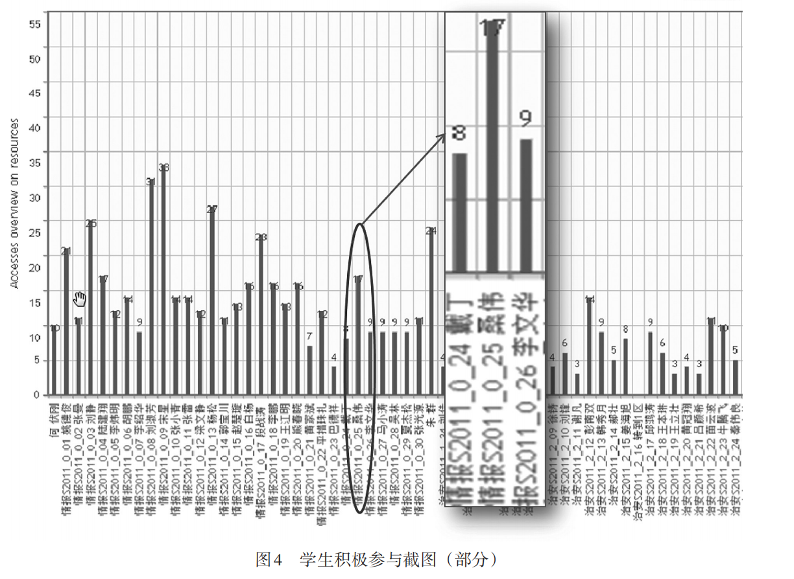
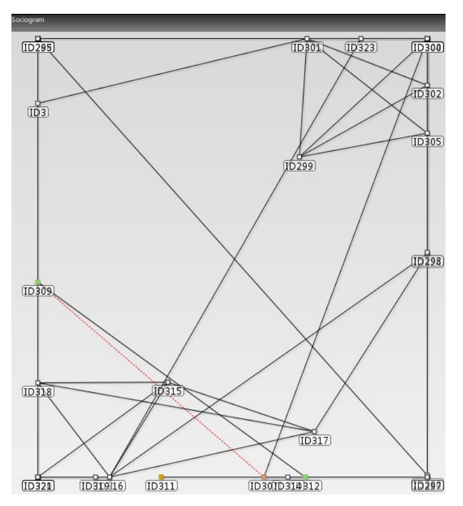
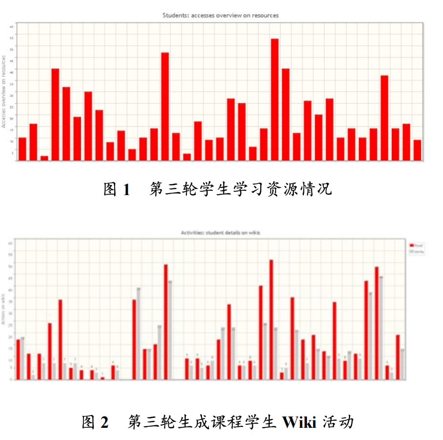
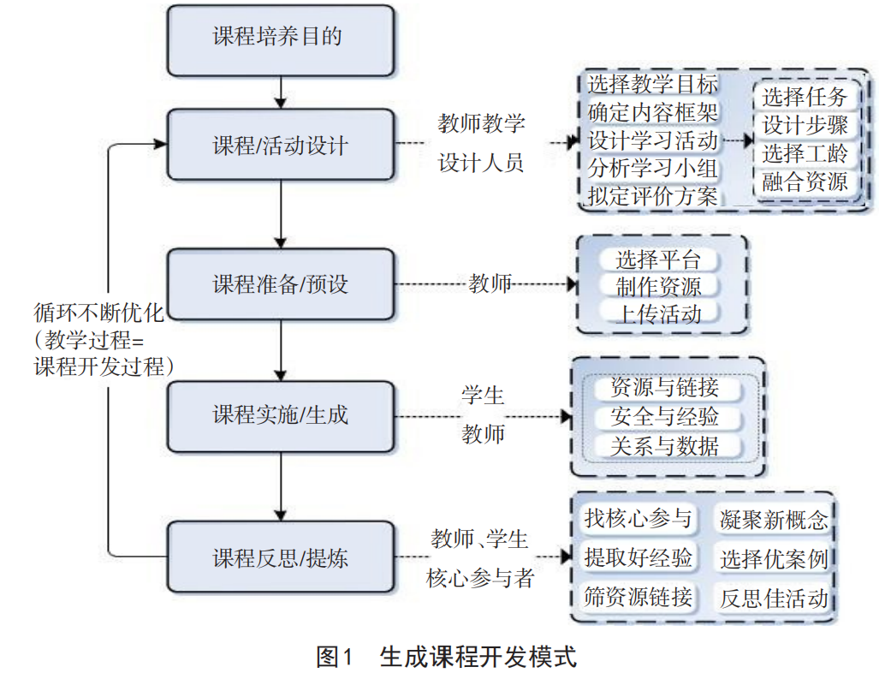
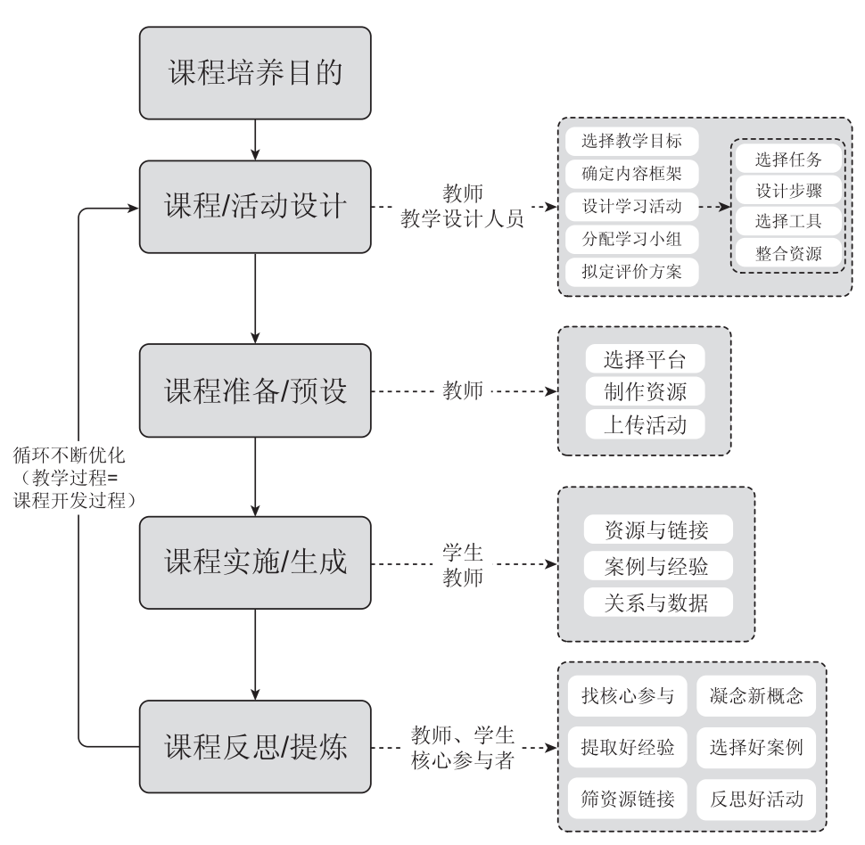

## Overview

- **Motivation:** Police training often lags behind emerging crime and operational demands. Since ready-made expertise is scarce, the studies explore how trainees’ practical knowledge can be captured and turned into usable learning content.

- **Methods:** Using iterative interventions in real training settings, the research combines platform records, participant feedback, and qualitative observation to trace how learning activities and resources evolve across repeated course cycles.

- **Outcomes:** The work yields actionable design principles for mobilizing learner experience, sustaining participation, and refining training content. It also clarifies teachers’ new roles and offers evidence-based guidance for digital police education.


```python
def hello(name: str) -> str:
    return f"Hello, {name}!"
```
From 2015 to 2019, the team conducted design-based research on connectivism-based emergent curriculum development for police practical training in the “Internet+” era. They argue that traditional models (MES, DACUM, BAG, subject-centered) cannot address fuzzy objectives, ill-structured knowledge, and rapidly changing practice in police training such as cybercrime investigation. Grounded in connectivism, learning is viewed as network formation, knowledge as dynamic and distributed, and teaching as curriculum development. The 2015 study proposed a cyclical model: objectives → preparation → activity design → implementation/emergence → reflection/refinement. Later studies refined it as objectives → activity design → preparation → implementation/emergence → reflection/refinement. Empirically, a Moodle-based “online investigation” course was implemented over three DBR iterations with 300+ trainees. Instruction followed four connectivist stages: social connection, experience reflection, information convergence, and collaborative innovation, using forums, blogs, wikis, tags, case discussions, mind maps, and voting. The 2018 and 2019 studies focused on resource development methods and technologies, including finding core participants, condensing concepts, selecting excellent cases, extracting experience, screening resource links, and reflecting on activities. Tools included Moodle logs, social network analysis, content analysis, tag clouds, Mod_sna, Ucinet, Gephi, and Diigo. Outputs include concepts, cases, experience, resource links, frameworks, core participants, and networks. These studies contribute a practical emergent curriculum model and concrete tools/rules, though further validation in other vocational fields is still needed.

- **Examples of the main figures and tables in the article**







## Results

Add figures, tables, and links to data or preprints. Place image files in
`static/img/` and reference them with a leading slash: ``.
