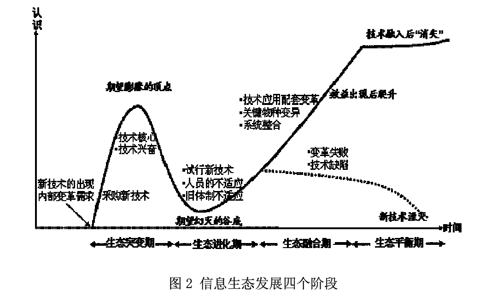
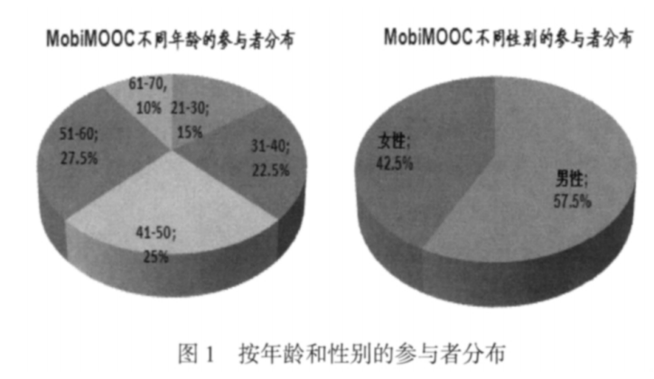
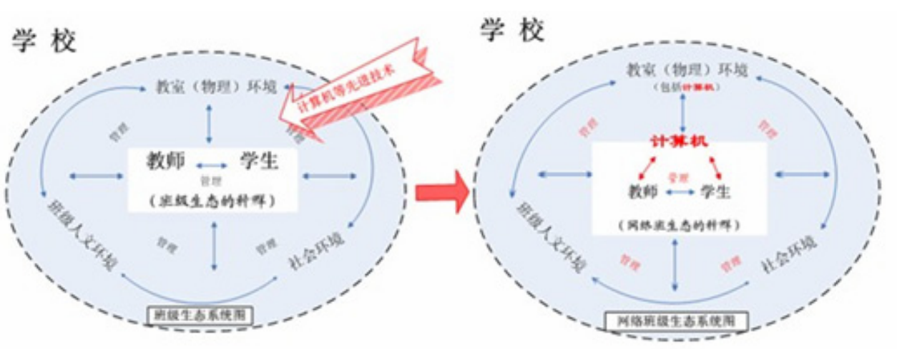
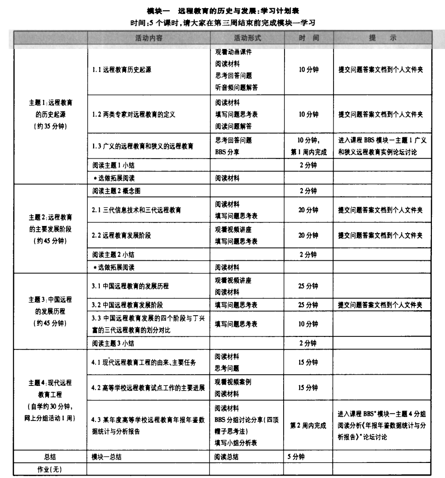

## Overview

- **Motivation:** Police academies are increasingly adopting digital technologies, yet traditional instruction and classroom management often remain unchanged. This project asks how technology-enhanced learning can support learner-centered, interactive, and sustainable police education.

- **Methods:** The project draws on literature review, action research, questionnaire surveys, interviews, classroom observation, and design-based research across web-based courses, blended teaching, personal learning networks, one-to-one digital classrooms, and mobile/social/open learning.

- **Outcomes:** It proposes activity-centered web course design, teacher facilitation skills for blended learning, ecological strategies for one-to-one network classroom management, and practical guidance for police academy digital instruction, online training, and academy-family collaboration. Together, these outcomes offer a systematic framework for technology-enhanced police education.


```python
def hello(name: str) -> str:
    return f"Hello, {name}!"
```
Since *2007 to 2014*, The team’s research traces a coherent trajectory in technology-enhanced learning: from web-based course design and blended teaching to personal learning networks, ecological classroom management, one-to-one digital learning, and mobile/social/open learning. Central concerns include learner-centered design, effective interaction, teacher roles, and sustainable environments.

Early work focuses on online course quality and blended teaching. “Design and Study of Learning Activity for Web-based Course” (2007) argues for activity-centered rather than resource-centered web courses, using cognitive and metacognitive strategies to promote deep learning. “New Requirements of Teacher Skills in Blended Teaching” (2008) reframes blended learning as teacher-led and student-centered, requiring teachers to facilitate deep learning, interaction, process management, and environment design.

A second strand explores personal learning networks and ecological management. “Personal Learning Network Technology and Its Educational Application” (2011) examines social bookmarking, publishing, and aggregation tools for personalized, connected PLEs/PLNs, noting risks like overload and privacy. His ecological view on one-to-one network classroom management (2010) treats technology as a disruptive “species,” proposing clear responsibilities, teacher development, student participation, and harmonious physical, human, and home-school environments. “Improving Classroom Management in One-to-One Digital Learning” (2014) adds teachers as “first among equals,” democratic participation, technology competencies, and home-school collaboration via WeChat.

His translations broaden the international dimension: the 2012 translation on mobile phones and Facebook shows mobile social networks creating authentic EFL learning; the 2013 translation on MOOCs in mLearning examines MobiMOOC and the synergy among connectivism, mobile learning, collaboration, and open resources. Together, these works form a systematic vision of technology-enhanced, learner-centered, connected, and sustainable education.

- **Examples of the main figures and tables in the article**






## Results

Add figures, tables, and links to data or preprints. Place image files in
`static/img/` and reference them with a leading slash: ``.
